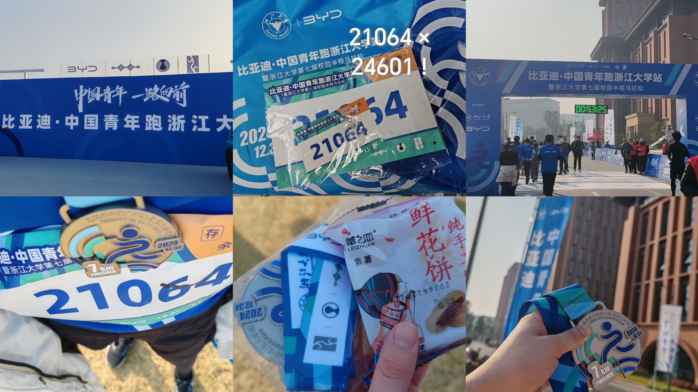

&nbsp;&nbsp;&nbsp;&nbsp;&nbsp;&nbsp;&nbsp;&nbsp;我会记得补给站的电解质水冰凉酸甜的味道、熙熙攘攘到疏疏散散过街的一抹蓝，以及这24年最后一日清晨的阳光和煦。
&nbsp;&nbsp;&nbsp;&nbsp;&nbsp;&nbsp;&nbsp;&nbsp;昨晚好似不似凌晨一两点才睡，今早难得没喝咖啡还如此亢奋地按时起床，连续熬夜过西欧时间的我的生物钟得救了。
&nbsp;&nbsp;&nbsp;&nbsp;&nbsp;&nbsp;&nbsp;&nbsp;赛程7km/1h，其实无论配速还是实际体验比12分钟跑甚至轻松些(12分钟前一晚我睡着时还没过零点)，比起1小时出头跑了三倍距离半马完赛的pro选手更是差远了。不过长跑是自己的比赛，对于现在这种菠萝菠萝哒身心状态的我来说欢乐跑也算的上挑战。
&nbsp;&nbsp;&nbsp;&nbsp;&nbsp;&nbsp;&nbsp;&nbsp;具体感觉，前2km没啥感觉，2.5~3km开始不行，过了4.5km又重新一身轻松了。忽然想起来体育中考前老师的话:“跑过了极点会迎来二次呼吸。”那时候我身强力壮如日中天八百米满分随便拿捏不以为意，现在亲身体会感受才真切。跑步还真是有意思。
&nbsp;&nbsp;&nbsp;&nbsp;&nbsp;&nbsp;&nbsp;&nbsp;看到5km标志，再看了眼时间，完赛稳了。遂降速，想着还留力气回去学习。其实半走半跑比全跑可能更累，楽。最后以龟爬般的慢速通过了终点，但指定时间内顺利完赛了，算是在一事无成的2024年末达成了一点小成就聊以安慰了。
&nbsp;&nbsp;&nbsp;&nbsp;&nbsp;&nbsp;&nbsp;&nbsp;虽然期末考前，虽然花20r报名，虽然长跑，看起来是没苦硬吃。但吃的很爽，明年还想吃😋
&nbsp;&nbsp;&nbsp;&nbsp;&nbsp;&nbsp;&nbsp;&nbsp;2025第一flag: 明年看身体状况和时间宽裕度自主训练吧，不行继续欢乐跑，行就挑战半马！

    
    
BYD赞助的简陋物资包，但20r要什么自行车。衣服S码冬天套外面有点小，明年换M吧。

    
欢乐跑号码牌不用芯片，数字我很喜欢，换序就是2！4！6！0！1！(没办法不唱出声了)

    
没有计时成绩，但有奖牌。今年的奖牌做的还不错，我觉得好康。鲜花饼味道一般。

 