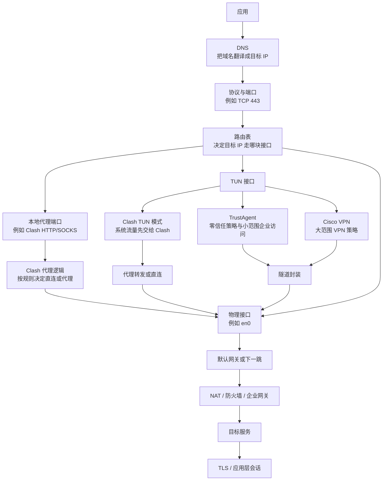
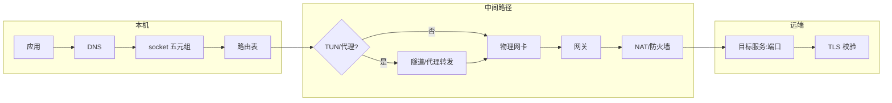
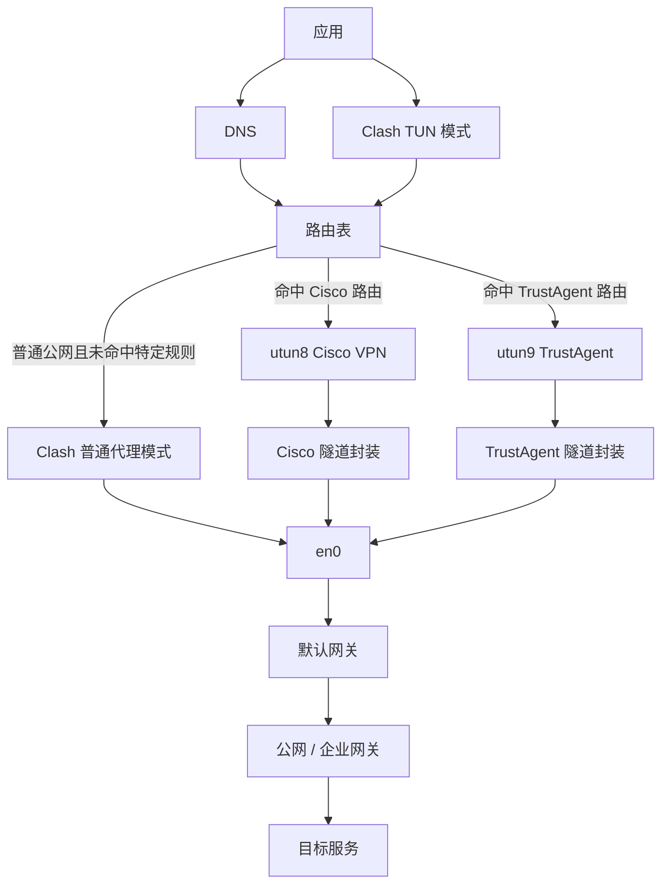
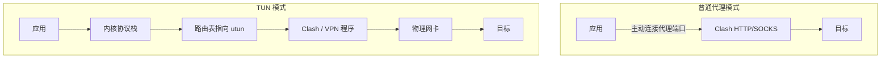
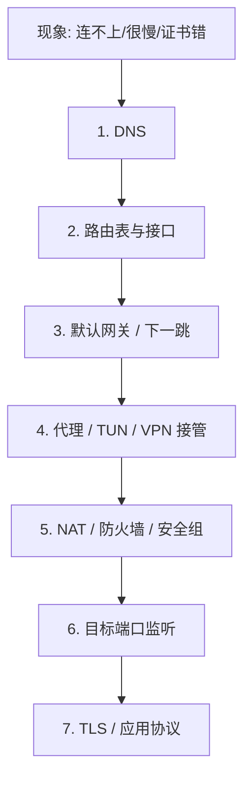

- 参考：<a href="https://www.xiaohongshu.com/discovery/item/69d85d410000000021011155?source=webshare&xhsshare=pc_web&xsec_token=ABYFs_PPzb2MK-4mpecdNdxAPTpb4Qloye3AquytA_8nI=&xsec_source=pc_share">【科研要懂的网络基础  - 哈基彤在update | 小红书 】</a>

<br>

## 总览

> [!INFO]+ 分层对照
>
> 需要拉代码、装依赖、连服务器、跑远程实验时，网络问题往往卡在某一具体层次；下表用于把现象快速映射到应检查的环节。

一次网络访问不是「应用 → 互联网 → 目标」这么短。本机操作系统、路由策略、虚拟接口、代理/VPN、出口 NAT、远端防火墙、目标进程监听端口、TLS 校验，任何一层都可能成为瓶颈。

| 层次 | 典型组件 | 常见问题表象 |
|------|----------|--------------|
| 应用层 | 浏览器、git、pip、SSH | 只有某个程序不通 |
| 名称解析 | DNS、hosts | 域名解析失败或解析到错误 IP |
| 传输寻址 | IP、端口、socket | 连错机器或连错服务 |
| 本机路由 | 路由表、默认网关 | 流量走错网卡或走错隧道 |
| 虚拟网络 | TUN、代理、VPN | 部分流量被接管、部分直连 |
| 出口与边界 | NAT、防火墙、安全组 | 本机通、外网不通 |
| 应用安全 | TLS、证书 | IP 可达但 HTTPS 报错 |

<br>

### 一次请求

假设打开一个网站，或在终端里执行一条命令，大致会经过以下步骤：

1. 应用发起请求
2. 如果目标是域名，先查 DNS，拿到目标 IP
3. 应用决定协议和端口
4. 操作系统查路由表，决定目标 IP 走哪张接口
5. 如果目标不在本地网段，流量先交给默认网关
6. 如果命中了 TUN 接口，流量先进入虚拟接口
7. 如果程序要建隧道，原始 IP 包会再封装一次
8. 如果应用使用代理，请求会先发给代理
9. 流量离开本机后，还会经过 NAT、防火墙、安全组、企业网关
10. 到达目标服务以后，很多应用还会继续做 TLS 校验

很多人遇到网络问题时，只会说“连不上”。但“连不上”背后，可能是完全不同的环节出了问题。

#### 流程图摘录（一）



#### 十步链路

上述十步可压缩为三层理解：

1. **本机决策**（步骤 1–5）：应用发什么、解析成谁、走哪张网卡
2. **中间改写**（步骤 6–9）：TUN/隧道/代理/NAT/防火墙
3. **对端验收**（步骤 10）：TLS 与业务协议握手



> [!EXAMPLE]+ 同一命令背后的多层检查
>
> 终端执行 `git clone https://github.com/org/repo.git` 时，至少隐含：
>
> 1. 应用是否读取 `HTTP_PROXY` / `HTTPS_PROXY` / `ALL_PROXY`
> 2. 系统 DNS 能否解析 `github.com`
> 3. 解析结果是否被路由表导向 Clash TUN 或企业 VPN
> 4. 出站 443 是否被本机或学校防火墙拦截
> 5. GitHub 返回的 TLS 证书是否被中间人代理替换
>
> 浏览器能 clone、终端不能 clone，往往说明问题卡在**应用层代理配置**，而非 DNS 或路由整体故障。

<br>

<br>

### 应用与端口

网络请求的起点是某个应用，常见的有：

- 浏览器
- curl
- git
- pip
- SSH 客户端
- VS Code Remote
- Python 程序里的某个库

应用通过 socket 与操作系统交互。IP 回答“去哪台机器”，端口回答“那台机器上的哪个服务”。

- `1.1.1.1:53` 常见于 DNS
- `8.8.8.8:443` 常见于 HTTPS
- `10.2.11.117:22` 常见于 SSH

完整连接目标通常写成：**协议 + 目标 IP + 目标端口**。

科研里很多“服务器能不能连上”的问题，最后都落在端口上。ping 通只能说明机器大概率在线，22、8888、6006 能不能访问，是另一回事。

#### Socket

应用不直接“发包上网”，而是通过 **socket** 向内核声明连接意图。一次 TCP 连接至少包含：

- 协议（TCP / UDP）
- 本地 IP 与端口
- 远端 IP 与端口

这就是常说的**五元组**。科研排障时，应先把报错翻译成“哪一段五元组建不起来”。

| 写法 | 含义 |
|------|------|
| `tcp://10.2.11.117:22` | 到内网主机 22 端口的 SSH |
| `tcp://142.250.x.x:443` | 到 Google 系服务的 HTTPS |
| `udp://1.1.1.1:53` | 向公共 DNS 发起查询 |

> [!WARNING]+ ping 与端口探测不是一回事
>
> - **ICMP ping**：测试主机是否响应 ICMP，**不等于** TCP 22/443/8888 已开放
> - **端口探测**：应使用 `nc`（netcat）、`telnet`、`curl -v`、`ssh -v` 等针对具体协议
>
> 典型误判：服务器 ping 通，但 Jupyter `8888` 未监听或未在安全组放行，仍无法访问。

> [!EXAMPLE]+ 本机监听检查
>
> Linux 服务器上确认服务是否绑定正确：
>
> ```bash
> ss -lntp | grep -E ':(22|8888|6006)\b'
> ```
>
> 期望看到类似 `0.0.0.0:8888` 或 `:::8888`。若只有 `127.0.0.1:8888`，则外网即使路由正确也无法直连，需改绑定地址或做端口转发。

<br>

<br>

### DNS

如果输入的是 `example.com` 这种域名，系统会先查 DNS，把它翻译成 IP。DNS 只管“这个域名对应哪个 IP”，后面的路径、代理、VPN 都不在它的范围里。

常见情况有：

- 内网域名只有企业 DNS 能解析
- 校园网和家宽下，解析结果不一样
- 代理已经接管流量，DNS 还在本地解析，于是出现 DNS 泄漏

所以“网站打不开”这句话太粗了。更有用的问法是：

- 域名有没有被正确解析
- 解析出来的 IP 对不对
- 这个 IP 是公网目标，还是企业内网目标

#### 职责边界

DNS 只做**名字 → IP**（及少量记录类型）。它不负责：

- 选哪条路由
- 是否走代理
- 是否进入 VPN 隧道

因此“DNS 解析成功”只说明**名字层面没问题**，后续每一层仍可能失败。

#### 常见异常

| 现象 | 可能原因 |
|------|----------|
| 校内能打开、回家打不开 | 内网 DNS 返回私有地址，公网 DNS 返回公网地址或解析失败 |
| 代理已开但网站仍显示本地运营商 DNS 泄漏 | 应用层代理了 TCP，但 DNS 查询仍走系统默认解析器 |
| `nslookup` 与浏览器结果不一致 | 浏览器走 DoH/DoT，终端走 `/etc/resolv.conf` |

> [!EXAMPLE]+ 终端侧 DNS 核对
>
> ```bash
> # 查看当前解析结果
> dig github.com +short
> dig huggingface.co +short
>
> # 指定公共 DNS 对比（排除本地 DNS 污染）
> dig @1.1.1.1 github.com +short
> ```
>
> 若 `dig github.com` 失败而 `dig @1.1.1.1 github.com` 成功，问题多半在**本机或局域网 DNS 配置**，而非目标站宕机。

> [!NOTE]+ 更有用的排障问法（展开）
>
> 1. **域名有没有被正确解析**：有无 `NXDOMAIN`、`SERVFAIL`、超时
> 2. **解析出来的 IP 对不对**：是否指向 CDN、是否误指向内网保留地址
> 3. **这个 IP 是公网目标还是企业内网目标**：`10.0.0.0/8`、`172.16.0.0/12`、`192.168.0.0/16` 在公网不可路由

<br>

<br>

### IP、默认网关与路由

电脑连上网络以后，通常会拿到一个本地 IP；开了 VPN 或零信任客户端，还会多出一层虚拟 IP。系统会先判断：目标 IP 和本机是不是在同一个本地网段。

- 如果在同一个网段，数据通常可以直接发过去
- 如果不在，就要交给默认网关

默认网关是兜底的下一跳。系统没有命中更具体的路由时，先把包交给它，剩下的交给路由器继续转发。路由表负责决定：

- 去某个目标 IP 时，应该走哪张接口
- 必要时，应该交给哪个下一跳

流量不总是走默认网关。只要路由表里有更具体的规则，系统就会优先走那条规则。

例如：

- `default -> en0`
- `10.2.11.117/32 -> utun9`

这时访问 `10.2.11.117`，不会走 `en0`，会直接走 `utun9`。因为 `/32` 比 `default` 更具体。这也是一台机器能同时挂多个网络工具的原因。真正决定流量归属的，是路由规则。

#### 同网段与默认网关

操作系统拿到 IP 地址与子网掩码后，可判断目标是否在同一二层广播域：

- **同网段**：ARP 解析目标 MAC，直接二层交付
- **跨网段**：封装发给**默认网关**，由网关继续转发

默认网关是路由表的**兜底项**（`0.0.0.0/0` 或 `default`）。更具体的前缀路由（如 `/32` 主机路由、`10.0.0.0/8` 企业网段）会优先匹配——这就是**最长前缀匹配**原则。

> [!EXAMPLE]+ macOS 路由表示例
>
> ```bash
> netstat -rn | head -20
> route -n get 10.2.11.117
> ```
>
> 若输出显示 `interface: utun9`，说明访问 `10.2.11.117` 被导向 TrustAgent 虚拟接口，而非物理网卡 `en0`。

> [!EXAMPLE]+ Linux 路由表示例
>
> ```bash
> ip route show
> ip route get 10.2.11.117
> ```
>
> `ip route get` 可直接显示内核将为该目标选择的出口接口与下一跳。

#### 多工具并存

Clash、Cisco VPN、TrustAgent 同时运行时，本机往往存在多张“逻辑网卡”：

| 接口类型 | 典型名称 | 作用 |
|----------|----------|------|
| 物理网卡 | `en0`、`eth0`、`wlan0` | 真实链路出口 |
| TUN 虚拟接口 | `utun0`–`utun9` | 由 VPN/零信任/Clash TUN 创建 |
| 回环 | `lo` | 本机进程间通信 |

**谁接管哪段流量，由路由表 + DNS 策略共同决定**，不是由客户端图标是否显示“已连接”决定。

<br>

<br>

### ARP 与 NDP

这一步很底层，但很重要。路由表告诉系统下一跳是谁，网卡真正发数据时，还要知道下一跳的二层标识。IPv4 里常见的是 ARP，IPv6 里常见的是 NDP。它们解决的问题是：

- 默认网关的 MAC 是什么
- 本地网段里某台机器的二层标识是什么

如果这一步出问题，常见现象是：

- DNS 看起来正常
- 路由也没问题
- 目标就在本地网段
- 结果还是发不出去

网络问题有时候会卡在比 DNS 和路由更靠后的位置。

#### 二层解析

路由表给出的是**下一跳 IP**。以太网真正发包时还需要 **MAC 地址**（二层地址）：

- **IPv4**：ARP（Address Resolution Protocol）
- **IPv6**：NDP（Neighbor Discovery Protocol）

ARP 表项错误、网关 MAC 变更未刷新、交换机端口隔离，都可能导致“三层看起来都对，包却发不出去”。

> [!EXAMPLE]+ 本机 ARP 检查
>
> ```bash
> # Linux
> ip neigh show
>
> # macOS
> arp -an
> ```
>
> 若默认网关 IP 在 ARP 表中状态为 `FAILED` 或长期 `INCOMPLETE`，应优先检查二层连通（网线、Wi‑Fi、交换机端口），而非继续调 DNS 或代理。

<br>

<br>

### NAT、防火墙与安全组

流量离开电脑以后，还会遇到 NAT、防火墙、安全组。NAT 是网络地址转换，本地私有 IP 离开路由器时，常会被改写成公网出口 IP，所以远端网站看到的，往往是家庭网络或学校网络的出口 IP。防火墙和安全组则决定流量能不能继续往前走。

它可能出现在：

- 本机
- 家用路由器
- 学校出口
- 公司网关
- 云服务器安全组

有路由，只说明路径在表里。能不能访问，还要看中间有没有被拦。科研服务器外网访问里，这类问题尤其常见。

在服务器上启动了一个服务，只说明它在本机能跑。想让外网访问到它，通常还要继续检查：

- 服务有没有监听正确端口
- 本机防火墙有没有放行
- 云平台安全组有没有放行
- 上级网络有没有公网入口
- 需不需要端口映射

很多人第一次配远程 JupyterLab、TensorBoard、Gradio、API 服务，都会停在这里。

#### NAT

家庭宽带、手机热点、实验室出口普遍使用 **NAT（Network Address Translation）**。内网主机使用私有地址，出网时被改写为**公网出口 IP**。

含义：

- 远端日志看到的是**出口 NAT 地址**，不是宿舍笔记本的内网 IP
- 从外网**主动连入内网主机**，通常需要端口映射、公网 IP、或反向隧道

#### 防火墙与安全组

| 位置 | 典型实现 | 科研常见卡点 |
|------|----------|--------------|
| 本机 | `ufw`、`firewalld`、`iptables` | 服务只监听 localhost；本机拒绝入站 |
| 云主机 | 安全组 / Network ACL | 只放行 22，未放行 8888 |
| 实验室网关 | 硬件防火墙 | 外网无法直达内网 GPU 节点 |
| 学校出口 | 统一策略 | 特定端口或境外流量受限 |

> [!EXAMPLE]+ 云端 Jupyter 外网访问最小检查清单
>
> 1. 进程监听：`ss -lntp | grep 8888`
> 2. 本机防火墙：`sudo ufw status` 或 `sudo iptables -L -n`
> 3. 云厂商安全组：入站规则是否含 `TCP 8888` 来源 `0.0.0.0/0` 或指定 IP
> 4. 是否误绑定 `127.0.0.1`：启动参数需含 `--ip=0.0.0.0`
> 5. 若机器在纯内网：是否需要 VPN/跳板机/SSH 本地转发
>
> ```bash
> # 本地通过 SSH 转发访问内网 Jupyter 的常用写法
> ssh -L 8888:127.0.0.1:8888 user@jump-host
> ```

> [!WARNING]+ “有路由”≠“能访问”
>
> 路由表只回答“包往哪张接口送”。NAT 是否允许、防火墙是否丢弃、安全组是否放行、目标端口是否监听，属于后续独立判断。科研场景里“内网能 curl、外网超时”极常见，应逐层排除而非重复重启代理客户端。

<br>

<br>

### TUN 接口

TUN 接口是一个虚拟接口。操作系统会把它当成一张网络接口，背后连接的是某个程序。

- 物理接口负责真正把包发出去
- TUN 接口负责让程序在系统层面接管 IP 包

很多现代网络工具都靠它工作：

- Cisco Secure Client
- 零信任客户端
- WireGuard
- Tailscale
- Clash 的 TUN 模式

普通代理模式下，应用主动把请求交给代理。到了 TUN 模式，请求是否经过某个程序，已经变成系统网络层的问题了。

#### 流程图摘录（二）



#### 定义

**TUN** 是操作系统提供的**三层虚拟网络设备**。写入 TUN 的数据被用户态程序（VPN 客户端、Clash、零信任 Agent）读取；程序处理后再经物理网卡发出。

| 对比项 | 物理接口 | TUN 接口 |
|--------|----------|----------|
| 数据去向 | 直接驱动物理网卡 | 先交予用户态程序 |
| 典型用途 | 日常上网 | 全局代理、企业 VPN、WireGuard |
| 对应用透明度 | 默认透明 | TUN 模式下对多数应用透明 |

依赖 TUN 的常见工具：Cisco Secure Client、各类零信任客户端、WireGuard、Tailscale、Clash TUN 模式。

#### 与普通代理的分层差异



普通代理：**应用层**决定是否找代理。TUN 模式：**系统路由层**先把 IP 包导入虚拟接口，应用往往无感知。

<br>

<br>

### 隧道

隧道做的事情很直接：

- 把原始 IP 包再包一层
- 让它穿过另一个网络到达远端
- 在远端再拆开

可以把它理解成一条逻辑运输管道。常见过程是：

1. 路由命中 TUN 接口
2. 程序从 TUN 接口读到原始 IP 包
3. 程序把原始 IP 包封装进隧道
4. 封装后的外层包再通过物理接口发出去

TUN 接口和隧道经常一起出现，但它们不是一回事：

- TUN 接口是入口
- 隧道是运输方式

#### 封装

隧道把**内层 IP 包**作为载荷，再套上**外层 IP 头**（及可能的外层加密），经另一条网络送达对端后解封装。可理解为逻辑运输管道：

1. 内层包：原本要发往 `10.2.11.117` 的流量
2. 外层包：发往 VPN  concentrator 或代理服务器
3. 对端拆掉外层，把内层包注入远端网络

常见四步：

1. 路由命中 TUN 接口
2. 程序从 TUN 读取原始 IP 包
3. 程序封装进隧道协议
4. 外层包经物理接口发出

> [!NOTE]+ TUN 与隧道的分工
>
> - **TUN 接口**：流量入口，决定“哪些包交给用户态程序”
> - **隧道协议**：运输方式（IPsec、OpenVPN、WireGuard、TLS over TCP 等）
>
> 二者常同时出现，但概念上可独立：有 TUN 不一定加密，有加密隧道也不一定用 TUN（如纯应用层 SSL VPN）。

<br>

<br>

### 代理

代理的核心思路很直接：应用先访问一个中间人，再由这个中间人代它访问目标。

常见场景包括：

- 浏览器代理
- HTTP 代理
- SOCKS 代理
- Clash 普通代理模式

如果应用使用代理，链路会变成：**应用先连代理，代理再连目标，最后把结果转回来。**

代理和 VPN 容易被混在一起。代理主要改变的是应用怎么出去，它未必会改系统路由，也未必会接管整机流量。所以很多人会遇到这种情况：

- 浏览器能正常走代理
- 命令行工具却像完全没配置过

这通常说明，应用有没有主动把请求交给代理，差别很大。

#### 工作方式

代理是**应用层或传输层的中间人**：

```
应用 ──► 代理 ──► 目标 ──► 代理 ──► 应用
```

常见类型：

| 类型 | 典型端口 | 特点 |
|------|----------|------|
| HTTP 代理 | 7890、8080 | 主要代理 HTTP/HTTPS（CONNECT 隧道） |
| SOCKS5 | 7891 | 更接近传输层，支持 TCP/UDP |
| 系统/浏览器代理 | 设置项 | 仅部分应用自动读取 |
| Clash 规则模式 | 混合 | 按域名/IP 分流直连或代理 |

#### 与 VPN 的区分

| 维度 | 代理 | VPN（典型企业/全局模式） |
|------|------|--------------------------|
| 作用层面 | 多为应用主动配置 | 常改系统路由与 DNS |
| 流量范围 | 通常仅配置了的应用 | 可覆盖整机 IP 流量 |
| 虚拟 IP | 一般无 | 常有隧道内地址 |
| 典型症状 | 浏览器通、终端不通 | 整机流量路径改变 |

> [!EXAMPLE]+ 终端让 git / pip 走代理
>
> ```bash
> export http_proxy=http://127.0.0.1:7890
> export https_proxy=http://127.0.0.1:7890
> export all_proxy=socks5://127.0.0.1:7891
> ```
>
> 不同工具读取的变量名不同：`git` 可读 `http.proxy`，`pip` 可读 `global.proxy`。未配置时，终端流量默认**直连**，与浏览器是否走系统代理无关。

<br>

<br>

### VPN 与零信任

VPN 常常会和代理放在一起说。它往往会把这些机制组合起来：

- 新的虚拟 IP
- TUN 接口
- 隧道
- 路由修改
- DNS 修改

最终效果是，设备在逻辑上接入了另一张网络。科研者访问实验室内网、公司内网、校园内网资源时，经常依赖这种能力。

企业零信任客户端也会用到同样的积木：

- TUN 接口
- 隧道
- 路由
- DNS

差别更多体现在策略层。传统 VPN 给更大的远端网络访问面，零信任会把授权范围收得更小。

#### 组合机制

典型 VPN 客户端往往同时做：

- 分配隧道内虚拟 IP
- 创建 TUN 接口
- 建立加密隧道
- 下发路由（分流或全量）
- 下发 DNS（防止内网名解析失败）

效果是设备**逻辑上接入另一张网络**，可访问实验室内网段、公司 CMDB、校内期刊库等。

#### 零信任与传统 VPN

| 对比 | 传统 VPN | 零信任（Zero Trust） |
|------|----------|----------------------|
| 访问面 | 接入后可见较大内网范围 | 按身份/设备/应用细粒度授权 |
| 典型产品形态 | Cisco AnyConnect 等 | TrustAgent、BeyondCorp 类客户端 |
| 技术积木 | TUN + 隧道 + 路由 + DNS | 相同，策略更细 |

企业零信任与传统 VPN 使用相似“积木”，差别主要在**策略层**——授权范围更小、会话更短、常伴随设备合规检查。

<br>

<br>

### TLS

很多人以为连上目标 IP，事情就结束了。很多应用层连接还会继续用 TLS，它负责：

- 加密应用数据
- 校验证书
- 确认连接到的是预期服务

VPN 和 TLS 不冲突：

- VPN 保护的是网络通道
- TLS 保护的是应用会话

完全可以同时存在：

- 一条被 VPN 保护的路径
- 一个继续被 TLS 保护的 HTTPS 连接

#### 连接建立之后

到达目标 IP 与端口后，HTTPS 等协议仍会进行 **TLS 握手**：

- 协商加密套件
- 校验服务器证书链
- 验证域名与证书 SAN 是否匹配（SNI）

因此可能出现：

- `ping` 通、`telnet 443` 通，但 `curl` 报证书错误
- 企业中间人代理替换证书，需在系统或应用中信任企业 CA

> [!NOTE]+ VPN 与 TLS 的关系
>
> - **VPN**：保护 IP 包在隧道中的一段路径
> - **TLS**：保护应用层会话内容
>
> 二者可叠加：流量先经 VPN 到达企业出口，再对 `https://internal.service` 进行 TLS。一层失效不意味着另一层自动补救。

> [!EXAMPLE]+ 快速区分网络层与应用层错误
>
> ```bash
> curl -v https://huggingface.co 2>&1 | head -30
> ```
>
> - 卡在 `Trying x.x.x.x...`：DNS 或路由问题
> - 卡在 `Connected` 之后 SSL 报错：TLS/证书问题
> - `HTTP/2 200`：传输链路基本正常

<br>

<br>

### 科研场景

放回科研场景里，把链路套到实际工作里，很多现象会清楚很多。

**上网探索**：查论文、下代码、拉模型、访问 Hugging Face / GitHub / 文档站。真正影响体验的，常常是：

- DNS 解析对不对
- 请求有没有被代理接管
- Clash 是普通代理模式还是 TUN 模式
- 路由有没有把流量送到预期出口

**访问实验室服务器**：从宿舍或家里连实验室服务器时，真正要看的通常是：

- 目标服务监听了哪个端口
- 外网入口有没有打开
- 防火墙和安全组有没有放行
- 是否必须通过 VPN 或零信任通道进入

**同时开多个网络工具**：同时开 Clash、Cisco VPN、TrustAgent 时，最好脑子里有一张清晰的图：

- Clash 普通代理模式更靠近应用层
- Clash TUN 模式会下沉到系统网络层
- Cisco VPN 和 TrustAgent 常见的插法是接管 TUN 接口，再建立隧道
- 最后谁接管哪部分流量，核心还是 DNS、路由表和接口匹配顺序

所以碰到“明明都开了，为什么还是不通”这类问题时，光看图标通常没什么帮助。

#### 上网与拉取资源

查论文、克隆仓库、`pip install`、`huggingface-cli download` 等操作，常见瓶颈依次为：

1. DNS 是否解析到可达 IP
2. 流量是否被 Clash 规则误判为直连
3. Clash 处于 TUN 还是普通代理模式
4. 路由是否将流量导向正确 `utun` 或 `en0`
5. 学校出口是否限制境外或大包连接

> [!EXAMPLE]+ Hugging Face 下载超时
>
> 建议按层排查：
>
> 1. `dig huggingface.co` 是否有合理 A 记录
> 2. `curl -I https://huggingface.co` 是否建立 TLS
> 3. 检查 `echo $https_proxy` 与 Clash 规则是否命中
> 4. 大文件场景尝试断点续传与镜像站，排除单连接被重置

#### 连实验室服务器

从宿舍/家里访问 GPU 节点或跳板机，需同时确认：

- 服务监听地址与端口（`0.0.0.0` vs `127.0.0.1`）
- 实验室防火墙与云安全组
- 是否必须先连 VPN/零信任才能路由到 `10.x` 网段
- SSH 跳板：`ProxyJump`、本地端口转发

#### 多工具并存

同时运行 Clash + Cisco VPN + TrustAgent 时，建议维护一张**本机路由意图表**：

| 目标网段 | 期望出口 | 由谁下发 |
|----------|----------|----------|
| `0.0.0.0/0` 默认 | `en0` 或 Clash TUN | 系统 / Clash |
| `10.2.0.0/16` 企业内网 | `utun8` Cisco | VPN 客户端 |
| `10.2.11.117/32` 单主机 | `utun9` TrustAgent | 零信任客户端 |

当实际 `ip route get` 结果与上表不符时，优先查**路由优先级与残留规则**，而非盲目切换“全局模式”。

<br>

<br>

### 排查顺序

理解这套链路以后，最大的变化通常是：知道应该从哪一层下手。

排查顺序通常是：

1. 先看 DNS
2. 再看路由
3. 再看默认网关和接口
4. 再看代理、TUN、VPN 谁在接管
5. 再看 NAT、防火墙、安全组
6. 最后看目标服务和 TLS

到这一步，很多原本模糊的报错会开始有形状。排查不再是试运气。

#### 分层顺序

推荐固定顺序：



#### 命令速查

| 层次 | Linux | macOS |
|------|-------|-------|
| DNS | `dig`、`resolvectl status` | `dig`、`scutil --dns` |
| 路由 | `ip route get <ip>` | `route -n get <ip>` |
| 监听 | `ss -lntp` | `lsof -iTCP -sTCP:LISTEN` |
| 代理环境变量 | `env \| grep -i proxy` | 同左 |
| 连通性 | `curl -v`、`nc -vz host port` | 同左 |

> [!EXAMPLE]+ “浏览器能开、终端不能”决策树
>
> 1. 浏览器是否配置了独立代理扩展？→ 是：说明仅浏览器走代理
> 2. 终端 `env` 是否存在 `http_proxy`？→ 否：需手动 export 或配置工具级代理
> 3. Clash 是否为 TUN 模式且路由已覆盖？→ 否：仅浏览器走系统代理时，终端仍可能直连
> 4. 若 TUN 已开仍不通：查 DNS 泄漏与规则 `MATCH` 兜底行为

> [!INFO]+ 心态与目标
>
> 网络排障的目标不是记住所有工具图标含义，而是把模糊报错映射到具体层次。一旦定位到“DNS 错”“路由错”“端口未开”“TLS 错”中的一类，后续操作就变成可查文档、可复现的常规步骤，而非反复重启客户端碰运气。

<br>

<br>
